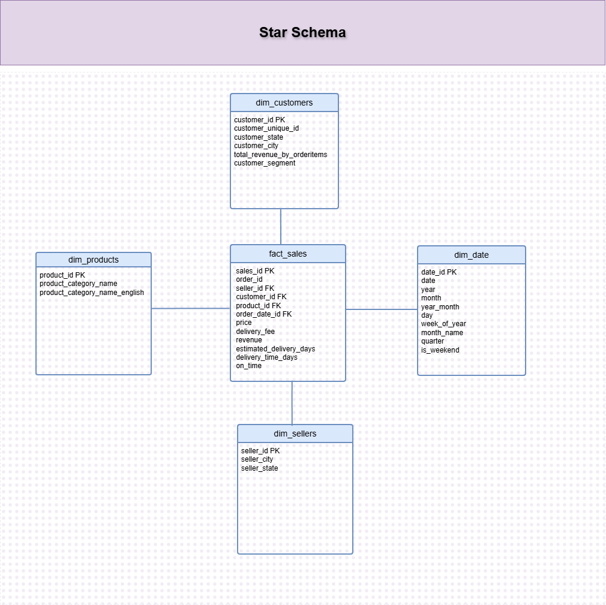
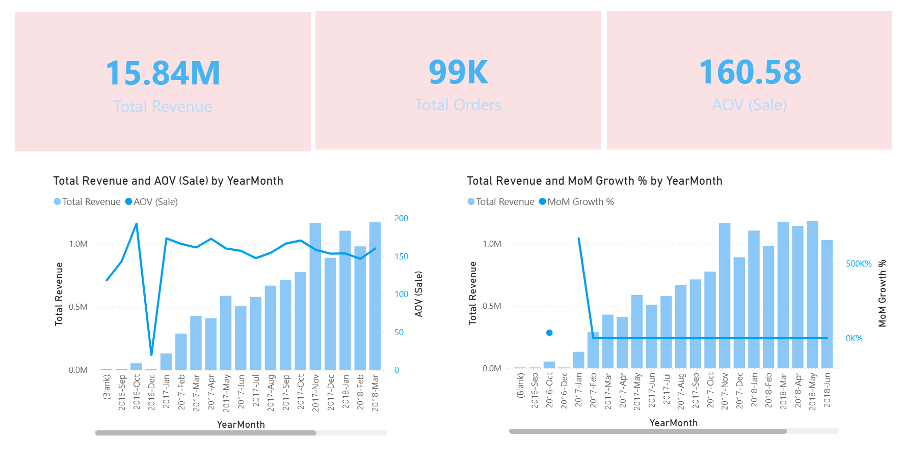
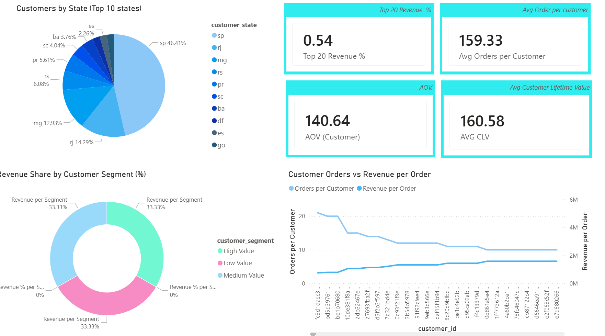
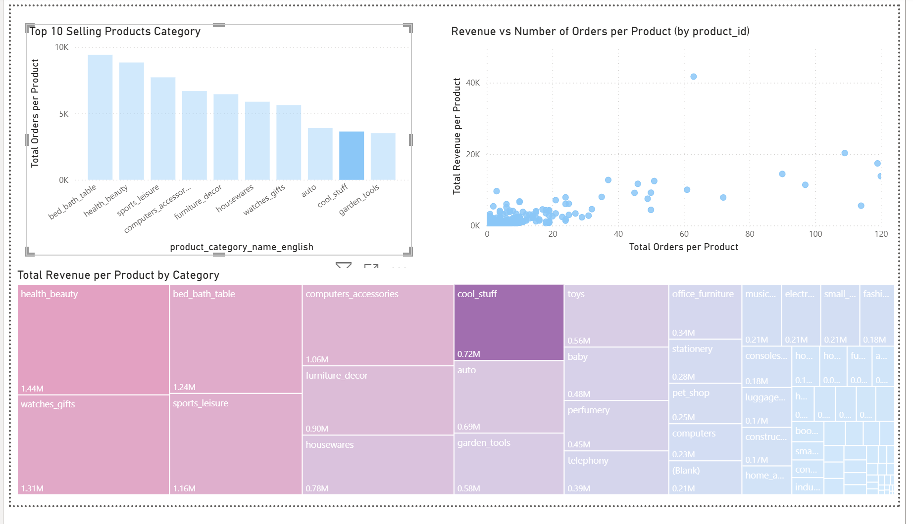

# E-commerce Sales Analysis 
 
This project builds on my SQL skills and applies them to real-world business analysis, focusing on transforming data into meaningful insights that support data-driven decision-making in an e-commerce environment.
 

 ---
## 📦Preparing project 

 
      
 Install Dependencies
    
       onece before start the etl pipline please run below step to install all required libraries 
        
                     +----------------------------------------------------+
                     |             pip install -r requirements.txt        |
                     +----------------------------------------------------+
       
        

   

## 🏗️ Data Architecture Diagram  

       
 Run ETL Pipeline
    
                            
                                          +--------------+
                                          |  Raw CSV     |
                                          | (Olist Data) |
                                          +--------------+
                                                 │
                                                 ▼
                                          +--------------+
                                          |   Extract    |
                                          |  Python ETL  |
                                          +--------------+
                                                 │
                                                 ▼
                                          +--------------+
                                          |   Transform  |
                                          | Data Cleaning|
                                          +--------------+
                                                 │
                                                 ▼
                                          +--------------+
                                          |  Staging DB  |
                                          | SQL Server   |
                                          +--------------+
                                                 │
                                                 ▼
                                          +--------------+
                                          | Star Schema  |
                                          +--------------+
                                                 │
                                                 ▼
                                          +--------------+
                                          | SQL Analysis |
                                          +--------------+
                                                 │
                                                 ▼
                                          +--------------+
                                          |  Dashboard   |
                                          | Power BI / BI|
                                          +--------------+
    

 

## 🧩 ER Diagram (Staging Table) 

  
 View ER Diagram
 
      

## 🧩 Activity Diagram 

  
 View Diagram
 
      

## ⭐ Star Schema 

     
 View Diagram
 
      

  

<!-- ##  🔖Topics

      - 📌 Business Problem  
      - 📊 Dataset  

 -->

  
<!-- ##  Data Pipeline

       ... 

 -->

## 📌 SQL Analysis  

    
 20 Business Questions

    
   ### 🟦 Sales Performance 
     - 1. What is the total revenue generated each month?    
     - 2️. How does monthly revenue change over time (Month-over-Month growth)?
     - 3. Which product categories generate the highest revenue? 
     - 4. What are the top 10 best-selling products by number of orders?  
     - 5. What is the Average Order Value (AOV)?  
    
   ### 🟩 Customer Analytics  
     - 6️. How many unique customers have made purchases on the platform?   
     - 7️. What percentage of customers are repeat customers?   
     - 8️. What is the average spending per customer (Customer Lifetime Value)?  
     - 9️. Which cities or states have the highest number of customers?    
     - 10.Do the top 20% of customers generate the majority of the revenue (Pareto analysis)?    
     
  ### 🟨  Delivery Performance
     - 11. What is the average delivery time from purchase to delivery?
     - 12️. What percentage of orders are delivered later than the estimated delivery date?   
     - 13️. Which sellers have the fastest average delivery times? 
     - 14. Which regions experience the longest delivery times?  
     - 15️. What is the average shipping cost (freight value) per order?  

 

  ### 🟥 Product & Seller Performance
    - 16️. Which sellers generate the highest total revenue?   
    - 17️. Which sellers receive the highest average customer review scores?  
    - 18. Which product categories have the lowest customer satisfaction scores?  
    - 19️. What is the average price of products in each category?    
    - 20. Is there a relationship between shipping cost and customer review scores?  

   

 
<!-- ## 🎯 Business Insights

       จดไว้ๆๆก่อน  
       Does higher shipping cost lead to lower customer satisfaction?  
       Electronics products generate the highest revenue but also experience longer delivery times.  

       20% of customers contribute over 60% of total revenue.  

       -Sales  
       Revenue grows strongly in Q4  
       -Product  
       Electronics generates the highest revenue  
       -Customer  
       Most customers come from São Paulo  
       -Delivery  
       Late deliveries correlate with low review scores  
       -Seller  
       Top 5 sellers generate 40% of revenue  

 -->

<!-- Key Insights

1. Top 10 sellers generate ~X% of total revenue
2. Average delivery time is X days
3. Late delivery rate is X%
4. States with longest delivery time: XX
5. Shipping cost has slight negative relationship with review score
6. Some product categories have lower customer satisfaction -->

<!-- Boleto payments introduce a delay in revenue recognition 
and have a higher drop-off rate compared to credit card payments, 
which can impact both conversion rate and cash flow. 
Brazil	       ไทย
boleto	        QR payment / ใบแจ้งชำระ
voucher	 coupon / ส่วนลด

-->
 

 <!-- ⚠️ Revenue Definition Note: "ตัวเลขนี้ represent ธุรกิจจริงไหม?"

This analysis separates product revenue and shipping fees.
Freight value is treated as a pass-through cost, not net profit,
due to the absence of logistics cost data.
✔ price = core revenue
✔ freight_value = customer-paid shipping fee
❌ freight_value ≠ profit -->

 

<!-- ## 📊 Dashboard Layout  

  
📊 View Dashboard Structure

  ### 🟦 Page 1 — Sales Overview
  - Total Revenue  
  - Total Orders  
  - Average Order Value (AOV)  
  - Monthly Revenue Trend  

      

  💡 Focus: Overall business performance

  ### 🟩 Page 2 — Customer Insights
  - Customers by State  
  - Top Customers  
  - Repeat Purchase Rate  
    ค่าใกล้ 1 → ลูกค้าส่วนใหญ่ซื้อครั้งเดียว
    Revenue is highly distributed across customers, with the top 10 customers contributing less than 1% of total revenue.

    The analysis shows that revenue is widely distributed across customers, with minimal contribution from top customers. Customer behavior is dominated by one-time purchases, indicating low retention. Growth opportunities lie in improving customer loyalty and increasing average order value.

  💡 Focus: Customer behavior & retention

  ### 🟨 Page 3 — Product Performance
  - Top Product Categories  
  - Revenue by Category  

  💡 Focus: Product contribution to revenue

  ### 🟥 Page 4 — Delivery & Reviews
  - Delivery Time Distribution  
  - Review Score Distribution  
  - Delivery vs Review Correlation  

  💡 Focus: Logistics impact on satisfaction

  -->
## 📊 Dashboard Layout  

  
📊 View Dashboard Structure

  ### 🟦 Page 1 — Sales Overview

    
   
   🛒 Key Insights
   - Growth is driven by volume (more orders), not value per order
   - Early-stage spikes in MoM are influenced by a low initial base
   - Recent trends show slowing growth, which may indicate market saturation or maturity 
   

  ### 🟩 Page 2 — Customer Insights
      
    
   
   🛒 Key Insights
   - The majority 46% of customers are concentrated in a few states.Focus marketing efforts in states with the highest customer concentration.
   - High-value customers (top 20%) drive a majority of revenue → prioritize retention and loyalty programs.
   - Consider segment-based strategies, as revenue is fairly evenly split among segments but profitability differs.
   - Customers display two main behaviors , followed by Many orders, lower revenue per order (frequent buyers) , Fewer orders, higher revenue per order (big spenders).Use order and revenue patterns to design targeted promotions and improve customer engagement.

  ### 🟨 Page 3 — Product Performance
     
   
   🛒 Key Insights
   - The top 10 product categories by number of orders show that bed_bath_table, health_beauty, and sports_leisure are the most popular among customers.Focus on top categories with high orders and revenue for marketing campaigns.
   - Products with many orders but lower revenue may indicate lower-priced items, while those with fewer orders but high revenue are high-value items.Monitor products with high revenue but fewer orders — potential high-margin opportunities. 

  ### 🟥 Page 4 — Delivery & Reviews
      In progress.......

 

<!-- ## 📚 Jupyter Notebook  

        อธิบาย flow....    

 -->
  
     
<!-- ## 🗺️Data Dictionary

  
  
view Table 

  
   ### 🟦 Table: orders
  | Column | Meaning (EN) | Meaning (TH) |
  |--------|-------------|--------------|
  | order_purchase_timestamp | Customer placed the order | ลูกค้ากดสั่งซื้อ |
  | order_approved_at | Payment approved | อนุมัติการชำระเงิน |
  | order_delivered_carrier_date | Order handed to carrier | ส่งให้บริษัทขนส่ง |
  | order_delivered_customer_date | Customer received the order | ลูกค้าได้รับสินค้า |

   ### 🟦 Table: order_items
  | Column | Meaning (EN) | Meaning (TH) |
  |--------|-------------|--------------|
  | order_purchase_timestamp | Customer placed the order | ลูกค้ากดสั่งซื้อ |
  | order_approved_at | Payment approved | อนุมัติการชำระเงิน |
  | order_delivered_carrier_date | Order handed to carrier | ส่งให้บริษัทขนส่ง |
  | order_delivered_customer_date | Customer received the order | ลูกค้าได้รับสินค้า |
 
  
  ### 🟦 Table: custormers 
  ### 🟦 Table: products 
  ### 🟦 Table: .... 
  ### 🟦 Table: .... 
  ### 🟦 Table: .... 

  -->
 

## 🛠 Tech Stack

      
       - 🛢️SQL
       - 🐍Python
       - 🐼Pandas
       - 🧱Data Modeling 
       - 🔄ETL Pipeline Design 
       - 📊PowerBI

     

## 📈 Future Improvements

      
       - Build interactive dashboard (Power BI / Tableau)
       - Add Jupyter Notebook 
       - Improve data model/star schema
       - Improve data validation pipeline
       - Improve cleansing and transaform data
       - Improve data story telling/Presentation Skill

## 🛢️ Dataset

     

       I would like to thank 
       <a href="https://www.kaggle.com/datasets/olistbr/brazilian-ecommerce" target="_blank">Olist</a> 🥰🤗
       for releasing this version of the Brazilian e-commerce dataset.
     

       

 
